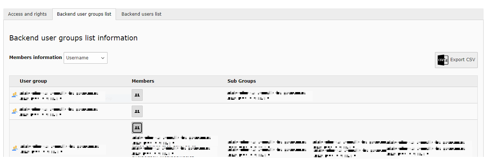
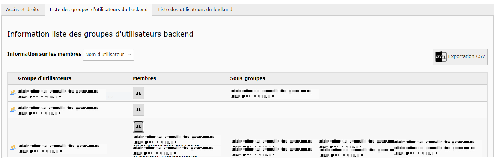

# Info Rights
## Change log

*La [version française](#documentation-info-rights) de la documentation suit le texte anglais*
### Add Members Column in Backend users group tab
By adding this column the user can now see for each group in this tab, the current members of a selected group by clicking on the members icon,
this functionality will make the user able to show the username, the email or the real name of the members.
this column is displayed by default in the Backend.
to hide this column, the following tsconfig option is used.

    mod.qcinforights.showTabGroups = 0

-----------
[Version française]
## Documentation Info Rights
En ajoutant cette colonne, l’utilisateur peut maintenant voir pour chaque groupe dans cet onglet, les membres actuels du groupe sélectionné en cliquant sur l'icon des membres,
cette fonctionnalité permettra à l’utilisateur d’afficher le nom d’utilisateur, le courriel ou le nom réel des membres.
cette colonne est affichée par défaut dans le Backend.
pour masquer cette colonne, l'option tsconfig suivante est utilisée :

    mod.qcinforights.showTabGroups = 0

