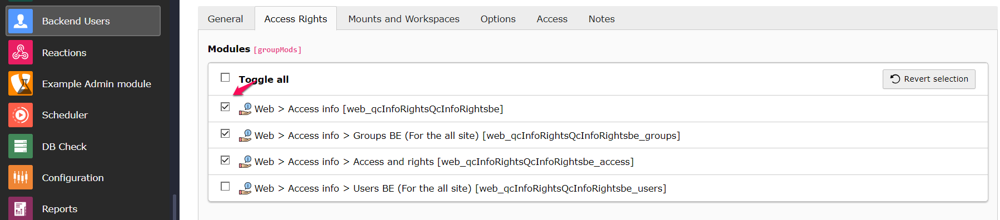

# Info Rights

*La [version française](#documentation-info-rights) de la documentation suit le texte anglais*

**IMPORTANT:**
In version 2.0.x (making it TYPO3 v12 compatible) we moved out from the Info module to its own: "Access Info". Access to sub-modules that were set using TSconfig is now managed with users and groups tab "Access Rights".

If you need it for TYPO3 v11 you need 1.x version of this extension.

### About
This extension add a new items to the Info Module in the BE with those features:

1. Shows BE rights for the pages (like in the Access Module) but for editors (as read-only)
2. Show a list of all BE Users (except if it begins with a "_" like "\_cli\_") with a filter and export as CSV(hidden by default)
3. Show a list of all BE User Groups with a filter and export to CSV (hidden by default),with an option that will return the list of members that are contained in these groups.


Main function is to show the actual BE right to non-admins:


BE users list with filters and CSV export button:


The extension has many options to hide columns or features.

We decide to hide by default the Users BE, and Groups BE element in the info Module menu. See the TSconfig below to activate this two menu items.


### Manage access
You should activate the ```web > Access info``` as parent module and then you can select one of the 3 modules

This module ```Web > Access info > Access and rights``` is used for the Access infor rights and this module replaces TsConfig ```showMenuAccess``` and ```showTabAccess```

This module ```Web > Access info > Groups BE (For the all site)``` is used to show a list of backend user group info and this module replaces TsConfig ```showMenuGroups``` and ```showTabGroups```

This module ```Web > Access info >  Users BE (For the all site)``` is used to show a list of backend user info and this module replaces TsConfig ```showMenuUsers``` and ```showTabUsers```



### Page TSconfig - default values

```
mod{
qcinforights{

    //This settings is to show or hide column under the tab access and right for owner,group, and everybody
    hideAccessRights{
      user = 0
      group = 0
      everybody = 0
    }

    //Display the Members column in the Backend user groups list
    showMembersColumn = 1

    //Specify the number of elements per page for the list of BE groups and BE users
    groupsPerPage = 100
    usersPerPage = 100

    //To show Export option for the backend users list or backend user groups list
    showExportUsers  = 1
    showExportGroups = 1

    //To show Administrator in the list of backend user
    showAdministratorUser = 1
}
```

### Global options - CSV

With the Settings module, go to Extension configuration and edit those values:

Default values:

1. Quotes (basic.quote): " (quotation mark)
2. Delimiter (basic.delimiter): , (comma)

-----------
[Version française]
## Documentation Info Accès

**IMPORTANT:**

Avec la version 2.0.x (compatibilité à TYPO3 v12), l'extension a maintenant son propre module "Info Accès". La gestion des accès aux sous-modules qui se faisait par TSconfig a été remplacée par la configuration Groupe ou utilisateurs, onglet "Droits d'accès".

Si vous devez utiliser TYPO3 v11, installer la version 1.x de cette extension.


### À propos
L'extension ajoute des nouveaux items de menu au module Info en BE avec les fonctionnalités suivantes:

1. Affichage des droits BE des pages (comme dans le module Access) mais pour les édimestres (lecture seulement)
2. Affichage des Utilisateurs BE (sauf si le nom débute par "_" comme "\_cli\_) avec filtre et exportation en CSV (masqué par défaut)
3. Affichage des Groupes BE avec filtre et exportation en CSV (masqué par défaut), avec l'option qui permet d'afficher la liste des membres de groupes sélectionnés.

L'extension offre plusieurs options pour masquer des colonnes ou fonctionnalités.

L'élément de menu Info module Utilisateurs BE et Groupes BE sont masqués par défaut, Voir le TSconfig qui suit pour activer ces éléments.

### Gérer l'accès du module
Vous devriez activer le ```web > Access info``` comme module parent et vous pouvez ensuite sélectionner l'un des 3 modules

Ce module ```Web > Access info > Access and rights``` est utilisé pour les droits d'accès aux informations et ce module remplace TsConfig ```showMenuAccess``` et ```showTabAccess```

Ce module ```Web > Access info > Groups BE (For the all site)``` est utilisé pour afficher la liste des informations sur les groupes d'utilisateurs backend et ce module remplace TsConfig ```showMenuGroups``` et ```showTabGroups```

Ce module ```Web > Access info >  Users BE (For the all site)``` est utilisé pour afficher la liste des informations sur les utilisateurs backend et ce module remplace TsConfig ```showMenuUsers``` et ```showTabUsers```


### Page TSconfig - valeurs par défaut

```
mod{
qcinforights{

    //Masquer ou afficher les colonnes (propriétaire, groupe, tout le monde) de l'onglet Accès et droits
    hideAccessRights{
      user = 0
      group = 0
      everybody = 0
    }

    // Masquer ou afficher la colonne qui sert à afficher les membres de chaque groupe dans l'onglet ( Liste des groupes BE)
    showMembersColumn = 1

    // Ces options sont utilisées pour spécifier le nombre des éléments par page successivement pour la liste des groupes BE et la liste des utilisateurs BE
    groupsPerPage = 100
    usersPerPage = 100

    //Masquer ou afficher les boutons d'exportation CSV. Ils sont visibles par défaut mais l'onglet qui les contient est masqué
    showExportUsers  = 1
    showExportGroups = 1

    //Masquer ou afficher les comptes BE des administrateurs. Visibles par défaut.
    showAdministratorUser = 1
}
```

### Options globales - CSV

Dans le module «Réglages», sous «Configure extensions» se trouvent 2 options relatives à l'exportation CSV.

Les valeurs par défaut sont:

1. Encadrement des valeurs (basic.quote): " (guillemet)
2. Délimiteur (basic.delimiter): , (virgule)
