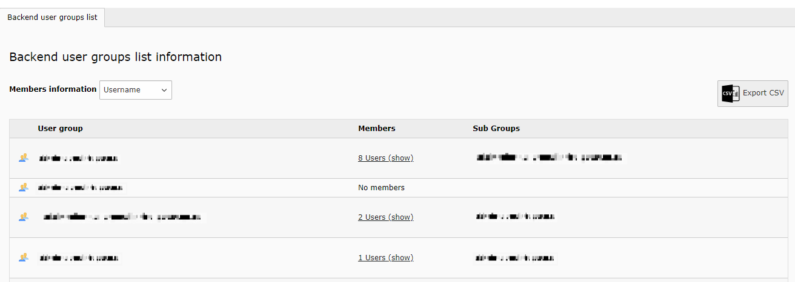
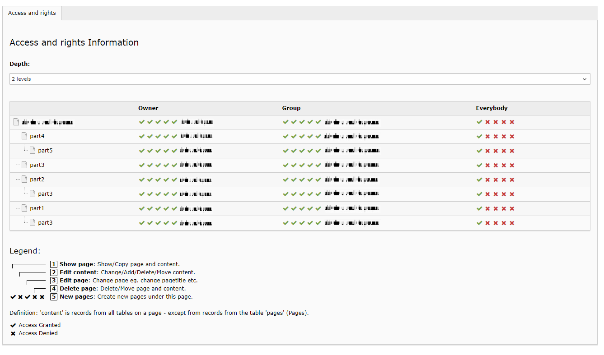
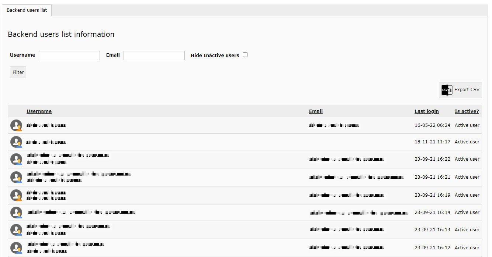
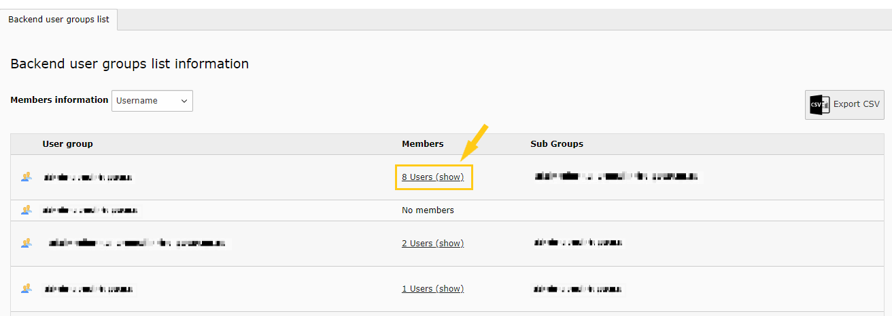

# Info Rights

*La [version française](#documentation-info-rights) de la documentation suit le texte anglais*

### About
This extension add a new items to the Info Module in the BE with those features:

1. Shows BE rights for the pages (like in the Access Module) but for editors (as read-only)
2. Show a list of all BE Users (except if it begins with a "_" like "\_cli\_") with a filter and export as CSV(hidden by default)
3. Show a list of all BE User Groups with a filter and export to CSV (hidden by default),with an option that will return the list of members that are contained in these groups.



Main function is to show the actual BE right to non-admins:


BE users list with filters and CSV export button:



The extension has many options to hide columns or features.

We decide to hide by default the Users BE, and Groups BE element in the info Module menu. See the TSconfig below to activate this two menu items.
### Page TSconfig - default values

```
mod{
qcinforights{

    //This settings is to show or hide column under the tab access and right for owner,group, and everybody
    hideAccessRights{
      user = 0
      group = 0
      everybody = 0
    }

    //This settings is to show or hide tab (Access and right, Backend users group, and backend user lists)
    showTabAccess  = 1
    showTabUsers   = 0
    showTabGroups  = 0

    //This options will replace the previous options, for show or hide the menu elements
    showMenuAccess  = 1
    showMenuUsers   = 0
    showMenuGroups  = 0

    //This option is to display the members column in the ( Backend user groups list )
    showMembersColumn = 1

    //These options are used to specify the number of elements per page successively for the list of BE groups and the list of BE users
    groupsPerPage = 100
    usersPerPage = 100

    //This settings is to show Exportation option for the backend users list or backend user groups list
    showExportUsers  = 1
    showExportGroups = 1

    //This settings is to show Administrator inside list of backend user
    showAdministratorUser = 1
}

### Global options - CSV

With the Settings module, go to Extension configuration and edit those values:

Default values:

1. Quotes (basic.quote): " (quotation mark)
2. Delimiter (basic.delimiter): , (comma)

-----------
[Version française]
## Documentation Info Droits

### À propos
L'extension ajoute des nouveaux items de menu au module Info en BE avec les fonctionnalités suivantes:

1. Affichage des droits BE des pages (comme dans le module Access) mais pour les édimestres (lecture seulement)
2. Affichage des Utilisateurs BE (sauf si le nom débute par "_" comme "\_cli\_) avec filtre et exportation en CSV (masqué par défaut)
3. Affichage des Groupes BE avec filtre et exportation en CSV (masqué par défaut), avec l'option qui permet d'afficher la liste des membres de groupes sélectionnés.



L'extension offre plusieurs options pour masquer des colonnes ou fonctionnalités.

L'élément de menu Info module Utilisateurs BE et Groupes BE sont masqués par défaut, Voir le TSconfig qui suit pour activer ces éléments.
### Page TSconfig - valeurs par défaut

```
mod{
qcinforights{

    //Masquer ou afficher les colonnes (propriétaire, groupe, tout le monde) de l'onglet Accès et droits
    hideAccessRights{
      user = 0
      group = 0
      everybody = 0
    }

    //Masquer ou afficher chacun des éléments de menu d'Info module (Accès et droits, Utilisateurs BE et Groupes BE)
    showTabAccess  = 1
    showTabUsers   = 0
    showTabGroups  = 0

    //Ces trois options vont remplacer les options utilisées pour masquer ou afficher les éléments de menu de Info module
    showMenuAccess  = 1
    showMenuUsers   = 0
    showMenuGroups  = 0


    // Masquer ou afficher la colonne qui sert à afficher les membres de chaque groupe dans l'onglet ( Liste des groupes BE)
    showMembersColumn = 1

    // Ces options sont utilisées pour spécifier le nombre des éléments par page successivement pour la liste des groupes BE et la liste des utilisateurs BE
    groupsPerPage = 100
    usersPerPage = 100

    //Masquer ou afficher les boutons d'exportation CSV. Ils sont visibles par défaut mais l'onglet qui les contient est masqué
    showExportUsers  = 1
    showExportGroups = 1

    //Masquer ou afficher les comptes BE des administrateurs. Visibles par défaut.
    showAdministratorUser = 1
}
```

### Options globales - CSV

Dans le module «Réglages», sous «Configure extensions» se trouvent 2 options relatives à l'exportation CSV.

Les valeurs par défaut sont:

1. Encadrement des valeurs (basic.quote): " (guillemet)
2. Délimiteur (basic.delimiter): , (virgule)
